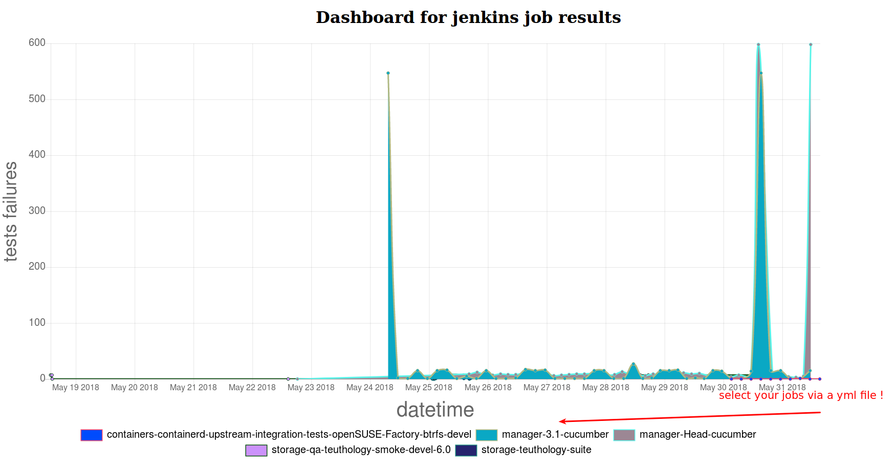

# Bacheca



##### You can also select interactively via browser only specific jobs and axes will scale depending on data.
##### The jobs of which you pick the tests are configurable via yml file!


Bacheca will help to analyze in deep tests.
At moment is under development, feel free to contribute at any time.

Feel free to take a look on milestones to see what is planed https://github.com/MalloZup/bacheca/milestones

### Prerequisites:

Your Jenkins jobs need to export tests_results in junit format, otherwise bacheca cannot fetch results.
Currently bacheca support only junit, which is de-facto jenkins-standard.

## Configuration

1) configure jenkins api

```bash
cd bacheca
touch config/credentials_jenkins.yml
```
here is how it should like the `credentials_jenkins.yml`

As password you can use a jenkins token.
```yml
server_url: 'my_beautiful_jenkins_server.it'
username: 'somename', 
password: 'secret password'
```
You can use also a `jenkins_token` for the `password`

2) Choose the jobs for fetching and display data.

There is already a `bacheca/config/job_jenkins.yml` file.

Adapt the array with your jenkins jobs.

an example:
```yml
jenkins_jobs: ["manager-3.1-cucumber", "saltstack-cooljobjenkins", "space-job", "bachecajob"]
```
Ensure that your jenkins user has access to the jobs


## Docker setups (reccomended)

You can have a look at the Dockerfile and have bacheca running in container!

```bash
docker build -t bacheca .
docker run -it -p 9000:3000 bacheca
```
Then visit `http://localhost:9000/` ! up and runnning!


## Without docker

0) you need to have installed rails.

```ruby
gem install rails
```
2) Feed and create database schemas with

For the first initialization, you can run manually:
```ruby
rake db:migrate
rake db:seed
```


### Database data update 

This project is using whenever gem, so you can activate the service for getting new data every hour with:
The config file for whenever is in `config/schedule.rb`

```whenever --update-crontab```

Whenever is already running in container mode.

3) run it!
```ruby
cd bacheca
rails server
```
