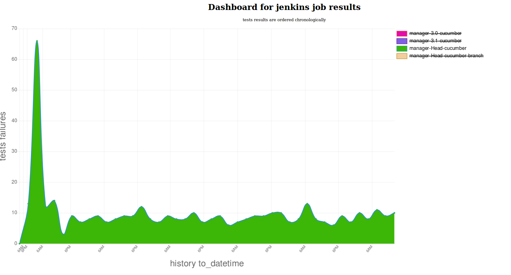

# Bacheca


##### You can also select only specific jobs and axes will scale depending on data.


Bacheca will help to analyze in deep tests.
At moment is under development, feel free to contribute at any time.

Feel free to take a look on milestones to see what is planed https://github.com/MalloZup/bacheca/milestones


## Setup for devel version ( only avaible currently)

0) you need to have installed rails.

```ruby
gem install rails
```

1) Configuration
Add the jenkins credentials you will need to setup

```bash
touch db/login_jenkins.yml
```
here is how it should like the `login_jenkins.yml`

As password you can use a jenkins token.
```yml
server_url: '0.0.0.0'
username: 'somename', 
password: 'secret password'
```

the `jobs_jenkins.yml` should contain a list of jobs.
```yml
jenkins_jobs: ["manager-3.1-cucumber", "manager-3.0-cucumber"]
```
Ensure that your jenkins user has access to the jobs

2) Feed and create database schemas with

```ruby
rake db:migrate
rake db:seed
```

3) run it!
```ruby
cd bacheca
rails server
```
